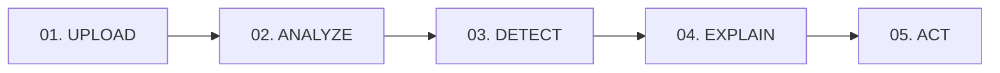

<div align="center">

# 🛡️ VisionGuard AI
### *"See What Humans Miss."*

**Autonomous AI-Powered Visual Inspection & Anomaly Detection Platform for Industrial, Construction, and Critical Infrastructure Safety.**

[](https://react.dev/)
[](https://vitejs.dev/)
[](https://tailwindcss.com/)
[](https://nodejs.org/)
[](https://expressjs.com/)
[](https://deepmind.google/technologies/gemini/)
[](https://supabase.com/)

[Key Features](#-key-features) • [5-Stage AI Pipeline](#-the-5-stage-autonomous-pipeline) • [Architecture](#-system-architecture) • [API Reference](#-api-endpoints) • [Quickstart](#-getting-started) • [Security](#-security--data-privacy)

---

</div>

## 📌 Executive Summary

Manual visual audits on construction sites, industrial facilities, and manufacturing lines are slow, inconsistent, and prone to human fatigue. Hairline fractures, unanchored safety harnesses, missing machine guards, and chemical weeping slip past manual spot-checks—escalating into catastrophic failures and severe regulatory penalties.

**VisionGuard AI** bridges this critical gap by providing an enterprise-grade visual intelligence engine. Inspectors upload high-resolution field photos or mobile captures, and VisionGuard’s multimodal vision models detect hazards, isolate spatial bounding coordinates, calculate statistical confidence ratings, cite regulatory standards (OSHA/ISO), and deliver immediate corrective action plans.

---

## ✨ Key Features

- 🎯 **Multimodal Anomaly Detection**: Identifies subtle structural fissures, missing PPE, unshielded mechanical pinch-points, exposed rebar, and blocked emergency egresses.
- 📐 **Spatial HUD & Coordinate Overlays**: Renders dynamic bounding box annotations `[ymin, xmin, ymax, xmax]` directly onto analyzed images with interactive zoom/pan controls.
- 🧠 **Explainable AI (XAI) Diagnostics**: Every anomaly features a *"Why was this detected?"* breakdown explaining underlying edge/texture cues and compliance codes.
- 🚨 **Automated Risk Severity Rating**: Instant risk classification across **`LOW`**, **`MEDIUM`**, **`HIGH`**, and **`CRITICAL`** hazard tiers.
- 📊 **Operational Telemetry Dashboard**: Real-time KPI tracking, risk distribution meters, category volume breakdowns, and audit trends.
- 📋 **Searchable Audit Logs**: Search, filter by severity/domain, sort, and export comprehensive diagnostic reports to PDF.
- 📱 **Field-Ready Responsive UI**: High-tech, dark-first interface optimized for desktop workstations and mobile site auditors.

---

## ⚡ The 5-Stage Autonomous Pipeline

VisionGuard processes every visual target through a structured 5-stage inference workflow:



1. **`UPLOAD`**: Ingests high-resolution images (`JPG`, `PNG`, `WEBP`) with in-memory validation and spatial tensor preprocessing.
2. **`ANALYZE`**: Feeds the image payload into **Google Gemini Vision (`gemini-2.5-flash` / `gemini-1.5-flash`)** models with domain-specific industrial safety prompts.
3. **`DETECT`**: Isolates bounding regions, tags objects, and determines defect severities with confidence scoring.
4. **`EXPLAIN`**: Generates explainable root-cause reasoning citing relevant safety standards (OSHA 1926/1910, ISO 45001, ANSI Z358).
5. **`ACT`**: Outputs a prioritized corrective action plan (`P1 - IMMEDIATE`, `P2 - HIGH`, `P3 - STANDARD`) and audit logs.

---

## 🏗️ System Architecture

```
Vision-Guard-AI/
├── client/                     # Frontend Application (React 19 + Vite + Tailwind CSS)
│   ├── src/
│   │   ├── components/
│   │   │   ├── auth/           # Protected route guards
│   │   │   ├── common/         # RiskBadge, ConfidenceBar, StatCard, ImageAnnotationViewer
│   │   │   └── layout/         # AppLayout, Sidebar, Navbar, Footer
│   │   ├── context/            # AuthContext (JWT session management)
│   │   ├── pages/              # Landing, Login, Register, Dashboard, Inspect, Results, History, Analytics, Profile, Settings
│   │   ├── services/           # Axios API clients (authService, inspectionService)
│   │   ├── App.jsx             # React Router v7 configuration
│   │   └── index.css           # High-tech design tokens, HUD effects & radar animations
│   └── package.json
│
├── server/                     # Backend API Service (Node.js + Express + Gemini SDK)
│   ├── src/
│   │   ├── config/             # Environment, Gemini AI instance, Supabase client
│   │   ├── controllers/        # authController, inspectionController
│   │   ├── middlewares/        # JWT authMiddleware, Multer uploadMiddleware, errorHandler
│   │   ├── routes/             # /api/auth, /api/inspections
│   │   ├── services/           # aiVisionService, dbService, storageService
│   │   ├── validations/        # Zod schemas for auth and AI structured responses
│   │   └── index.js            # Express server entry point
│   ├── .env.example            # Backend environment template
│   └── package.json
│
├── package.json                # Root package for workspace orchestration
└── .gitignore                  # Clean repository ignore configuration
```

---

## 📡 API Endpoints

### 🔐 Authentication (`/api/auth`)
| Method | Endpoint | Description | Auth Required |
| :--- | :--- | :--- | :--- |
| `POST` | `/api/auth/register` | Register new inspector account | No |
| `POST` | `/api/auth/login` | Authenticate inspector & return JWT token | No |
| `GET` | `/api/auth/profile` | Retrieve current authenticated auditor profile | **Yes (Bearer)** |
| `PUT` | `/api/auth/profile` | Update profile information (name, role, organization) | **Yes (Bearer)** |

### 🔍 Inspections & Diagnostics (`/api/inspections`)
| Method | Endpoint | Description | Payload / Query |
| :--- | :--- | :--- | :--- |
| `POST` | `/api/inspections/analyze` | Upload image & run Gemini Vision AI analysis | `multipart/form-data` (`image`, `category`, `description`) |
| `GET` | `/api/inspections` | Query inspection audit history | `?search=...&risk=...&category=...&limit=50` |
| `GET` | `/api/inspections/:id` | Fetch single diagnostic report by ID | Path parameter `:id` |
| `DELETE` | `/api/inspections/:id` | Delete an inspection audit record | Path parameter `:id` |
| `GET` | `/api/inspections/analytics` | Fetch aggregate risk & domain telemetry | Returns metric KPIs & distributions |

---

## 🚀 Getting Started

### 📋 Prerequisites
- **Node.js** (v18.0.0 or higher)
- **npm** (v9.0.0 or higher)
- **Google Gemini API Key** ([Get free key here](https://aistudio.google.com/))
- *(Optional)* Supabase project credentials for cloud PostgreSQL & Storage

---

### 📥 1. Clone & Install Dependencies

```bash
# Clone the repository
git clone https://github.com/hassansiddiqueai/Vision-Guard-AI.git
cd Vision-Guard-AI

# Install Client Dependencies
cd client
npm install

# Install Server Dependencies
cd ../server
npm install
cd ..
```

---

### ⚙️ 2. Configure Environment Variables

Create `server/.env` based on `server/.env.example`:

```bash
cd server
cp .env.example .env
```

Edit `server/.env`:
```env
PORT=5000
NODE_ENV=development
CLIENT_URL=http://localhost:5173

# JWT Secret
JWT_SECRET=your_super_secret_jwt_key_2026

# Google Gemini API Key
GEMINI_API_KEY=your_gemini_api_key_here

# Supabase Credentials (Optional - Local fallback active by default)
SUPABASE_URL=https://your-project.supabase.co
SUPABASE_KEY=your_supabase_key_here
```

---

### 🏃 3. Run Locally

From the root directory, you can start both client and server:

#### Terminal 1 — Start Backend Server:
```bash
npm run dev:server
# Server running at http://localhost:5000 (Health Check: http://localhost:5000/api/health)
```

#### Terminal 2 — Start Frontend Client:
```bash
npm run dev:client
# Client running at http://localhost:5173
```

---

## 🔒 Security & Data Privacy

- 🔑 **Zero Client-Side Key Exposure**: The Google Gemini API key resides solely inside backend environment variables.
- 🛡️ **In-Memory Buffer Streaming**: Uploaded image payloads are ingested via in-memory buffers to avoid unencrypted disk staging.
- 🔏 **JWT Authorization**: 256-bit encrypted Bearer tokens for all protected inspector operations.
- 🔒 **Data Sanitization**: Strict input and output validation powered by **Zod** across every layer.

---

## 👥 Authors & Acknowledgements

- **VisionGuard AI Team** — Built for the AI & Computer Vision Hackathon.
- Powered by **Google Gemini Vision API** and **Supabase**.

---

<div align="center">
  <sub>Built with ❤️ for industrial safety, workplace hazard prevention, and zero-accident job sites.</sub>
</div>
